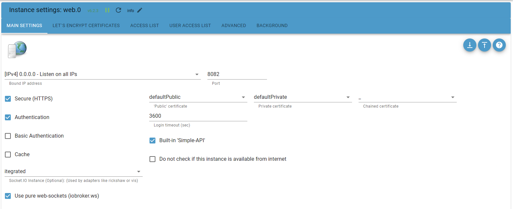

<div align="center">
    <h1>ngx-iobroker</h1>
</div>

<p align="center">
This library offers the possibility to integrate a <a href="https://github.com/ioBroker">ioBroker</a> server quickly and easily into an <a href="https://angular.dev/">Angular</a> application.
</p>

<p align="center">
<a href="https://www.npmjs.com/package/ngx-iobroker"></a>
<a href="https://github.com/pottio/ngx-iobroker/blob/main/LICENSE"></a>
</p>


<br/>

## Requirements

A [ioBroker](https://github.com/ioBroker) server with installed adapter [ioBroker.ws](https://github.com/ioBroker/ioBroker.ws) or adapter [ioBroker.web](https://github.com/ioBroker/ioBroker.web) with activated pure websockets is necessary.



In case of secure connection via HTTPS and self signed certificate, make sure the root CA is installed as trusted CA on all client devices.

## Getting Started

Install `ngx-iobroker` from npm:

```bash
npm install ngx-iobroker --save
```

Add configuration into `app.config.ts`:

```typescript
import { IoBrokerWsConfiguration, ioBrokerWsConfigurationToken } from 'ngx-iobroker';

const ioBrokerConfiguration: IoBrokerWsConfiguration = {
  clientName: 'sample-app',
  hostnameOrIp: '<ioBrokerIpOrHostname>',
  port: 8082,
  secureConnection: true,
  historyAdapter: 'influxdb.0',
  credentials: {
    user: '<ioBrokerUser>',
    password: '<ioBrokerPassword>',
  },
  autoLoadScriptOnInit: true,
  autoSubscribes: ['0_userdata.*'],
};

export const appConfig: ApplicationConfig = {
  providers: [
    provideRouter(routes),
    {
      provide: ioBrokerWsConfigurationToken,
      useValue: ioBrokerConfiguration,
    },
  ],
};
```

Import `IoBrokerWsService` in the needed component(s):

```typescript
import { Component, inject } from '@angular/core';
import { takeUntilDestroyed, toSignal } from '@angular/core/rxjs-interop';
import { IoBrokerWsService } from 'ngx-iobroker';

@Component({
  selector: 'app-root',
  standalone: true,
  imports: [],
  template: `
    <div>
      Connected: <strong>{{ ioBrokerConnected() }}</strong>
    </div>
    <p>See console logs (F12) for state changes</p>
  `,
})
export class AppComponent {
  private readonly _ioBroker = inject(IoBrokerWsService);

  public readonly ioBrokerConnected = toSignal(this._ioBroker.connected$, { initialValue: false });

  constructor() {
    this._ioBroker.stateChanged$.pipe(takeUntilDestroyed()).subscribe((value) => {
      console.log(`${value.id}: ${value.state?.val}`);
    });
  }
}
```

## Configuration

| Parameter            | Description                                                       | Required |
| -------------------- | ----------------------------------------------------------------- | -------- |
| clientName           | right-aligned                                                     | required |
| hostnameOrIp         | The hostname or ip of ioBroker                                    | required |
| port                 | The port number of web / ws adapter                               | required |
| secureConnection     | Connect via HTTPS                                                 | optional |
| credentials          | Username and password of ioBroker user                            | optional |
| historyAdapter       | The instance name of default history adapter                      | optional |
| autoLoadScriptOnInit | Auto load necessary socket javascript file from ioBroker server\* | optional |
| autoSubscribes       | Directly subscribes to IDs/Patterns after init connection         | optional |

\* if deactivated `` it is necessary to load the script in client via index.html:

```html
<!doctype html>
<html>
  <head>
    <!-- Replace "<protocol>" with http or https and "<hostnameOrIp>" / "<port>" with real IP address / port of controller -->
    <script type="text/javascript" src="<protocol>://<hostnameOrIp>:<port>/socket.io/socket.io.js"></script>
    <!-- ... -->
  </head>
  <body></body>
</html>
```

## License

[MIT](../../LICENSE)
