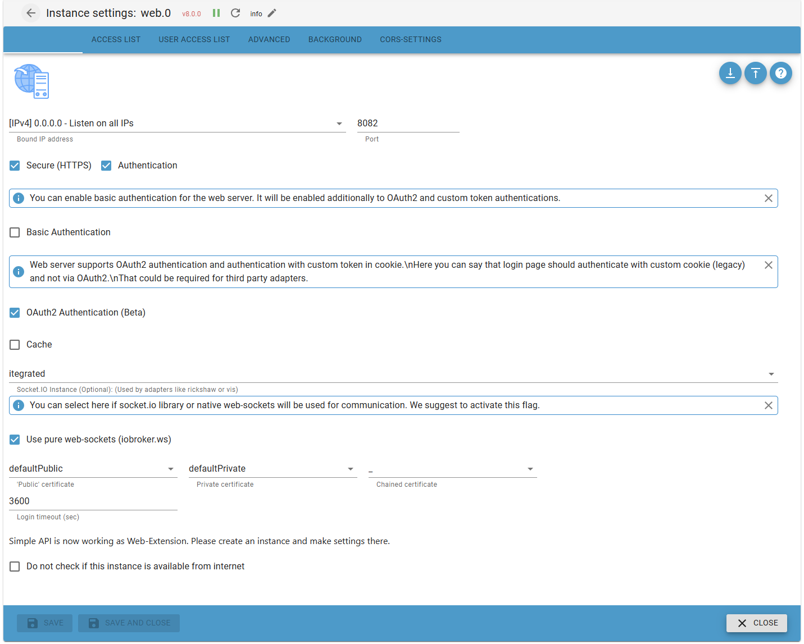

<div align="center">
    <h1>ngx-iobroker</h1>
</div>

<p align="center">
This library offers the possibility to integrate a <a href="https://github.com/ioBroker">ioBroker</a> server quickly and easily into an <a href="https://angular.dev/">Angular</a> application.
</p>

<p align="center">
<a href="https://www.npmjs.com/package/ngx-iobroker"></a>
<a href="https://github.com/pottio/ngx-iobroker/blob/main/LICENSE"></a>
</p>

<br/>

## Requirements

A [ioBroker](https://github.com/ioBroker) server with installed adapter [ioBroker.ws](https://github.com/ioBroker/ioBroker.ws) or adapter [ioBroker.web](https://github.com/ioBroker/ioBroker.web) with activated pure websockets is necessary.



In case of secure connection via HTTPS and self signed certificate, make sure the root CA is installed as trusted CA on all client devices.

If authentication is enabled, you may need to adjust the CORS settings.

Angular version compatibility: The major version of **ngx-iobroker** is compatible with the corresponding major version of Angular

| ngx-iobroker | Angular |
| ------------ | ------- |
| 20.x         | 20.x    |

## Getting Started

Install **ngx-iobroker** from npm:

```bash
npm install ngx-iobroker --save
```

Add configuration into `app.config.ts`:

```typescript
import { IoBrokerWebSocketConfiguration, ioBrokerWebSocketConfigurationToken } from 'ngx-iobroker';

const ioBrokerConfiguration: IoBrokerWebSocketConfiguration = {
  clientName: 'sample-app',
  hostnameOrIp: '<ioBrokerIpOrHostname>',
  port: 8082,
  secureConnection: true,
  historyAdapter: 'influxdb.0',
  credentials: {
    user: '<ioBrokerUser>',
    password: '<ioBrokerPassword>',
  },
};

export const appConfig: ApplicationConfig = {
  providers: [
    provideRouter(routes),
    {
      provide: ioBrokerWebSocketConfigurationToken,
      useValue: ioBrokerConfiguration,
    },
  ],
};
```

Import `IoBrokerWebSocketService` in the needed component(s):

```typescript
import { Component, inject } from '@angular/core';
import { takeUntilDestroyed, toSignal } from '@angular/core/rxjs-interop';
import { IoBrokerWebSocketService } from 'ngx-iobroker';

@Component({
  selector: 'app-root',
  standalone: true,
  imports: [],
  template: `
    <div>
      Connection-State: <strong>{{ ioBrokerConnectionState() }}</strong>
    </div>
    <p>See console logs (F12) for state changes</p>
  `,
})
export class AppComponent {
  private readonly _ioBroker = inject(IoBrokerWebSocketService);

  public readonly ioBrokerConnectionState = toSignal(this._ioBroker.connectionState$);

  constructor() {
    this._ioBroker.connect();
    this._ioBroker.stateChanged$.pipe(takeUntilDestroyed()).subscribe((value) => {
      console.log(`${value.id}: ${value.state?.val}`);
    });
  }
}
```

## Configuration

| Parameter        | Description                                  | Required |
| ---------------- | -------------------------------------------- | -------- |
| clientName       | Individual name                              | required |
| hostnameOrIp     | The hostname or ip of ioBroker               | required |
| port             | The port number of web / ws adapter          | required |
| secureConnection | Connect via HTTPS                            | optional |
| credentials      | Username and password of ioBroker user       | optional |
| historyAdapter   | The instance name of default history adapter | optional |

## Usage

### Observables

| Observable       | Description                                                                              | Type                                                       |
| ---------------- | ---------------------------------------------------------------------------------------- | ---------------------------------------------------------- |
| ready$           | WebSocket connection is established. Ready receive messages and send commands.           | boolean                                                    |
| connectionState$ | State of WebSocket connection.                                                           | ConnectionState ('disconnected', 'connecting','connected') |
| errors$          | Errors during connection or message handling.                                            | string                                                     |
| stateChanged$    | State change of subscribed states via `subscribe(...)` or `subscribeStates(...)` command | object (id: string, state: ioBroker.State or null)         |
| objectChanged$   | Object change of subscribed objects via `subscribeObjects(...)` command                  | object (id: string, state: ioBroker.Object or null)        |

### Connection handling

- `connect(): Promise<void>`
- `disconnect(): Promise<void>`

### Commands

All commands described in [ioBroker.socket-classes repository](https://github.com/ioBroker/ioBroker.socket-classes#web-methods) are supported.

In addition, the following methods have been added to simplify the handling of historical values via history adapter.

- `getHistoryConfigurations(historyAdapter?: string): Promise<Record<string, Partial<IoBrokerHistoryConfig>>>`
- `enableHistoryForDataPoint(id: string, config: Partial<IoBrokerHistoryConfig>, historyAdapter?: string): Promise<IoBrokerHistoryConfigResult>`
- `disableHistoryForDataPoint(id: string, historyAdapter?: string): Promise<IoBrokerHistoryConfigResult>`

## License

[MIT](../../LICENSE)
